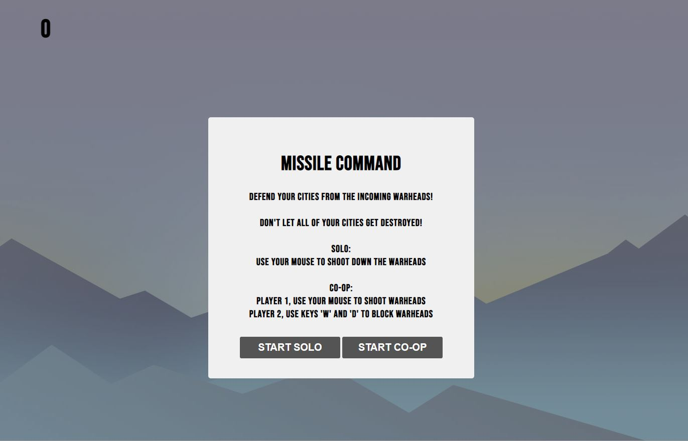
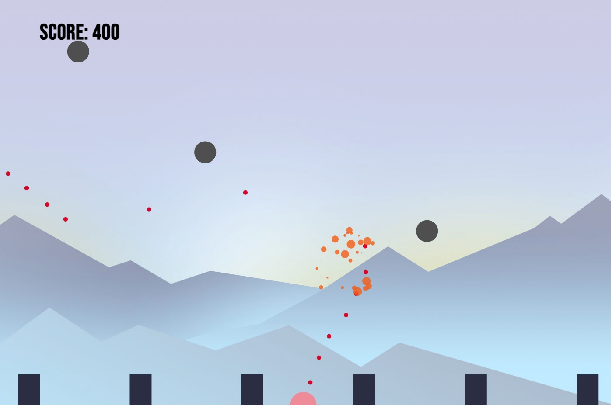
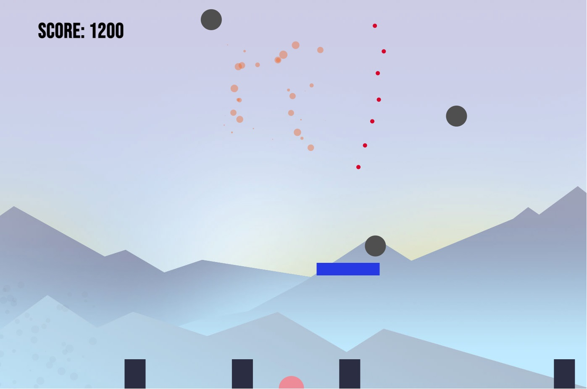
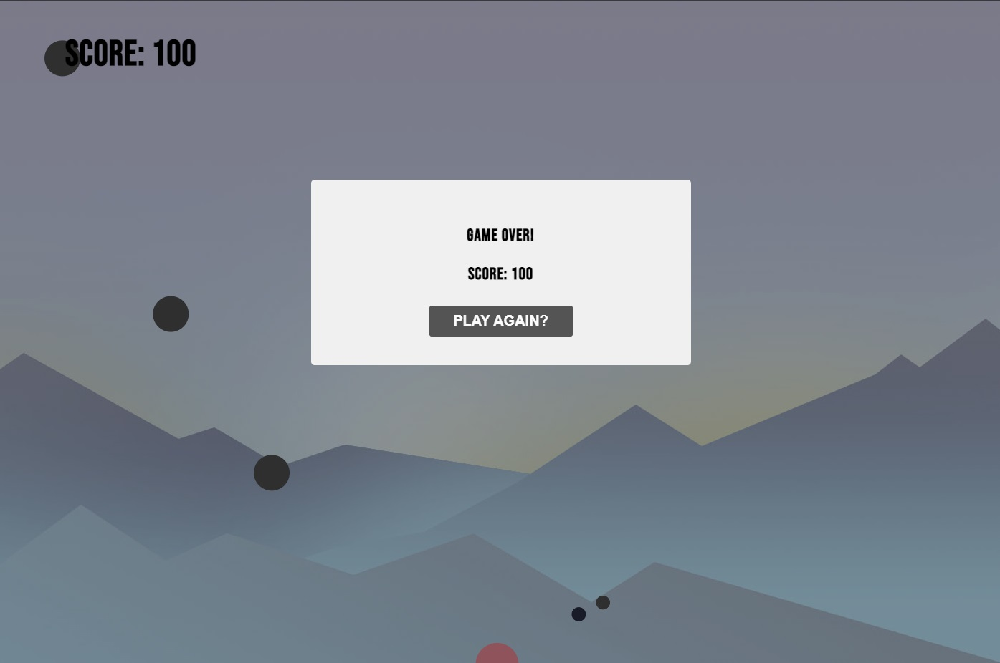

# Missile Command

## About the game:

---

A browser based game inspired by the 1980 Atari arcade classic. 6 cities are being bombarded by countless warheads. It is up to you, to defend the cities by shooting them down.

## Game Link:

---

https://wenjietee.github.io/missile-command/

## Game Tutorial:

---

Defend the cities from warheads! Game over when all cities are destroyed.

-   Solo: Use your mouse to aim and fire at the warheads.
-   Co-op: Use keys 'W' and 'D' to block the warheads.

## API Used:

---

The Internet Chuck Norris Database: http://www.icndb.com/ (For the joke displayed at game over)

## Technologies Used:

---

-   HTML
-   CSS
-   Javascript
-   JQuery
-   Ajax
-   Canvas

## Approach Taken

---

My goal is to create a fun and fast game inspired by the arcade classic. Initially researched on particle and collisions and canvas API with the resources (links at the bottom). Made some test projects based on the resources and then refactored into the game.

## Achievements

---

-   Added Solo and Co-op choices for more playability. Player 2 can use a shield to block warheads.
-   Added some particle effects for more satisfying kill.

## Challenges

---

-   Collision detection between the canvas elements (enemy,missile,city) and canvas edges.

    -   Solved: Splitting the collision checking into 3 helper functions each checking for 1 collison type (eg. enemy to missile, enemy to city)

-   All the elements on canvas requires calling on multiple canvas methods to render it.

    -   Solved: Refactoring the canvas methods into helper functions which will be called throughout the element objects.

-   Toggling between Co-op and Solo mode
    -   Solved: Created a bool property (isCoOp) for player 2 object. Player 2 is actually created on load, but if isCoOp is false the game will not trigger the collision detection, rendering and event listeners. Only if the 'Co-op' button is selected which will toggle isCoOp to true and then the game will start rendering player 2 and trigger its associated methods.

## Known Issues

---

-   ~~Player 2 collision issue where warheads will be blocked at the rectangle corners of Player 2 but not at the center.~~ [ Patched 07/09/21 ]
-   Enemy is spawned before the game is started. A huge rain of enemies will rain down on the player if the game is left to idle without starting.
-   On resizing the browser, the game needs to be refreshed to adapt to the new dimensions.
-   Crosshair might be small on bigger screens.

## Screenshots

---

-   Game starts and prompts player/s for Solo or Co-op mode.
    

-   Solo mode, player only shoots down warheads.
    

-   Co-op mode, player 1 shoots down warheads and player 2 blocks warheads.
    

-   Game over when all cities are destroyed.
    

## Extra Features Planned

---

-   Highscore board
-   New enemy types

## Resources Used

---

-   Trajectory and particles: https://www.youtube.com/watch?v=eI9idPTT0c4
-   Basic collision check: https://developer.mozilla.org/en-US/docs/Games/Techniques/2D_collision_detection
-   Rectangle and circle collision check: https://stackoverflow.com/questions/21089959/detecting-collision-of-rectangle-with-circle
-   Collision detection of circle and rectangle: https://stackoverflow.com/questions/34345765/collision-detection-of-circle-and-rectangle
